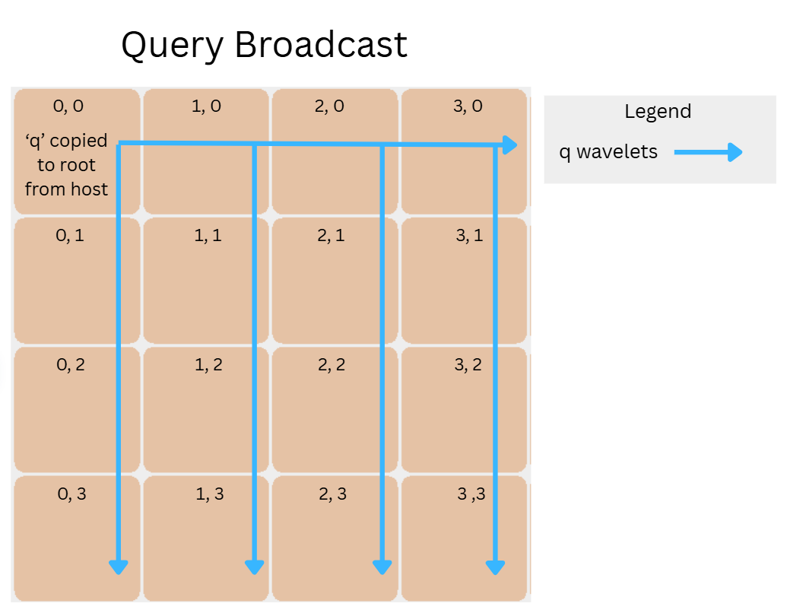
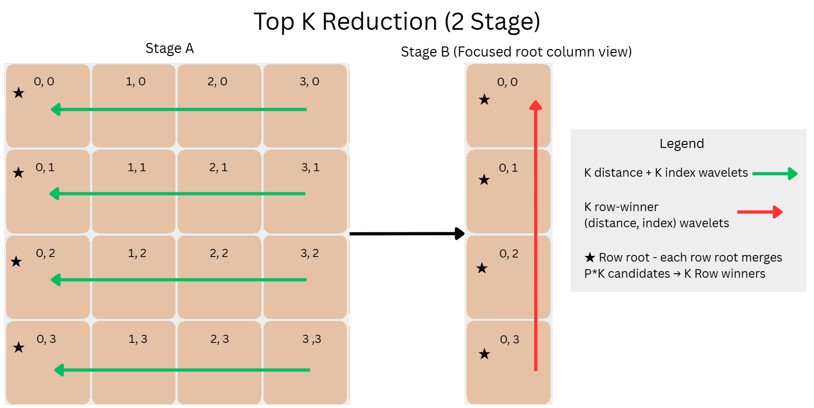

# DESIGN

Start time: 9:38 PM EST, April 28, 2026

## Local Top-K Strategy

Each PE computes exact squared L2 distance:

```text
||D_i - q||^2 = ||D_i||^2 + ||q||^2 - 2 * dot(D_i, q)
```

The host precomputes `D_norms = ||D_i||^2 + ||q||^2`. The PE only adds
`-2 * dot(D_i, q)`, removing repeated `||q||^2` work.

The dominant loop is distance accumulation: `O(rows_per_pe * d_dim)`. Each
feature uses one vector `@fmacs` over all local rows. The first FMAC starts from
`D_norms`, so there is no separate initialization sweep. 

- When `d_dim` is divisible
by 8, the host packs `D` in feature blocks so the DSD stride is 8. 

Baseline compute is about 25k cycles for `128*32=4096` local elements, 
roughly 6 cycles per element including loop and address overhead.

Local selection depends on K:
`K==1` uses linear argmin, `K==16` uses sorted insertion, `K==rows_per_pe` keeps
all valid rows, and larger non-full K uses a max-heap. Insertion has low overhead
for small K and produces sorted streams. The heap is better for large K:
`O(rows_per_pe log K)` instead of shifting up to K slots per insert.

## Routing Topology

The kernel runs on a `P x P` PE rectangle. PE `(px, py)` owns rows starting at
`(py * P + px) * rows_per_pe`. The host sends `valid_count` so padding rows are
ignored during local selection.

The host copies `D`, `D_norms`, and `valid_count` to **every** PE. The host copies
`q` **only** to PE `(0,0)`. The device broadcasts `q` in two steps: across the top
row on x colors `0/1`, then down each column on y colors `4/5` using the collectives_2d libray.



After compute (see local top-), candidates reduce in reverse. Each row gathers local top-K to the
row root at `px=0`, which merges `P*K` candidates to K row winners. Column 0
then gathers row winners to PE `(0,0)` for the final top-K.



The x collective entrypoints are task IDs `10/11`; y entrypoints are `12/13`.
Query wavelets carry `q`; candidate wavelets carry one distance or one index. I
keep distance and index gathers separate because fusing them hurt `k_large`.


## Fabric Bandwidth

Each 32-bit distance or index is one payload wavelet. During row gather, each PE
sends `K` distance wavelets and `K` index wavelets toward `px=0`. The hot edge is
next to the row root because traffic from the other `P-1` PEs can cross it. Worst
case on that edge is:

```text
2 * K * (P - 1) candidate wavelets
```

Column gather has the same hot-edge count for row winners. For baseline
(`P=4,K=16`), this is `96` candidate wavelets. For `k_large` (`P=2,K=256`), it
is `512`. Query broadcast is smaller: `d_dim` wavelets per path. Traces show
baseline is mostly memcpy plus FMAC compute, while large K exposes more
reduction/root work.

## Tie-Breaking

Every stage uses the same comparison rule: smaller distance wins; if distances
are equal, smaller original row index wins. Padding uses `(INF,SENTINEL_INDEX)`,
so padding never beats a real row.

It is safe for each PE to emit only local top-K. If a local row is not in that
PE's top-K, then at least K rows on the same PE are no worse than it. Therefore
that row cannot be in the global top-K. Row roots and the final root merge using
the same comparison rule, so fabric arrival order does not change the answer.

## With 2x More Time

I would sweep small unroll factors in the blocked FMAC loop to reduce loop and
address-update overhead, likely saving hundreds to low-thousands of cycles. I
would also tune reduction scheduling to remove callback gaps, targeting another
few hundred to about 1-2k cycles.
